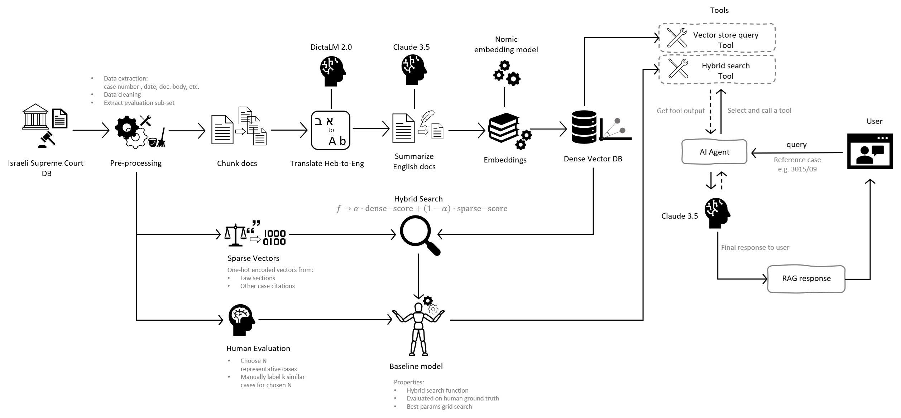
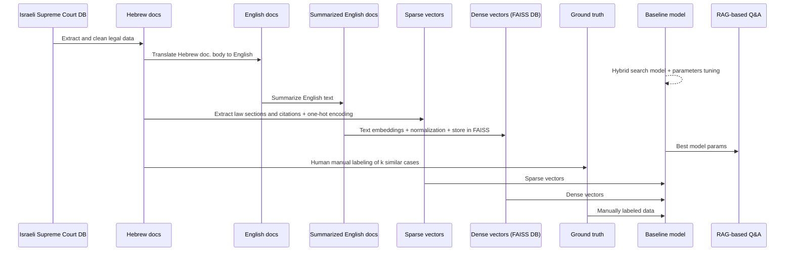
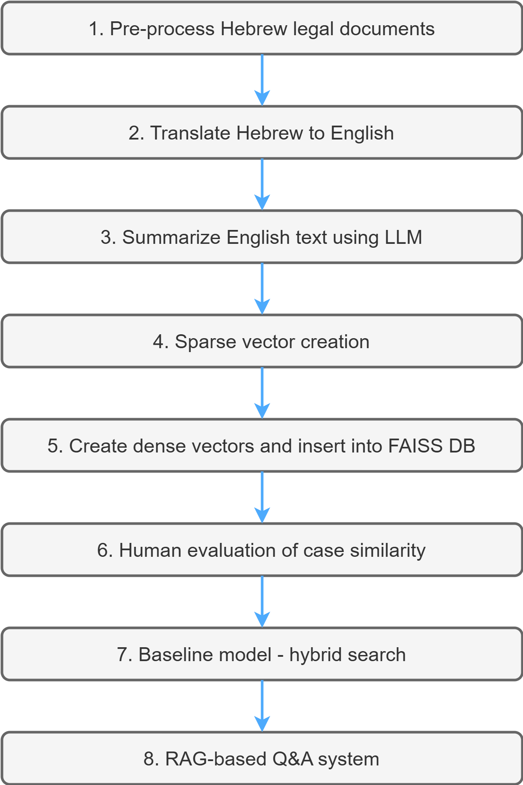

# **L**egal **C**ases **S**imilarity **D**etection

## Assignment Info

**Course**: Applied Research Seminar (66220), HIT 2025  
**Lecturer**: [Prof. Jonathan Schler](https://academic.hit.ac.il/en/faculty_staff/Jonathan_Schler)  
**Assignees**: Stas Susha

## Abstract

This project presents a Legal Case Similarity Detection (LCSD) system designed to retrieve similar legal cases from Israeli Supreme Court dataset. It integrates semantic embeddings (dense vectors) with citation-based (sparse vectors) features within a hybrid search framework. The system supports retrieval of similar cases, with specific attention to Hebrew-language legal texts.

## Introduction

Precedent plays a crucial role in legal systems, guiding judicial decisions through established case law. Legal professionals must locate relevant precedents efficiently, but the volume and complexity of legal documents—especially in Hebrew jurisdictions—pose challenges.

This project addresses these challenges using the Israeli Supreme Court Database (1997–2022) and implements a hybrid AI-powered system that:

- Translates Hebrew text to English.
- Summarizes case content using LLMs.
- Computes dense embeddings and sparse citation vectors.
- Applies a weighted scoring function to retrieve top-k similar cases.

## Installation

### Python Environment Setup

1. Install Anaconda on your machine – [link](https://www.anaconda.com/download)
2. Create Python 3 (we used 3.12.4) virtual environment:
   ```bash
   python -m venv venv
   ```
3. Activate environment:
    * **Windows**:
      ```bash
      .\venv\Scripts\activate
      ```
    * **macOS/Linux**:
      ```bash
      source venv/bin/activate
      ```
4. Install requirements:
   ```bash
   pip install -r requirements.txt
   ```
   alternatively, you can run the `environment.ipynb` notebook to install all dependencies.

## LLM Model Setup
To use the LLM models, you need to install Ollama and download the required models:
1. Download and install [Ollama](https://ollama.com/download) on your machine.
2. Start the Ollama server:
   ```bash
   ollama serve
   ```
   This will start the Ollama server on `http://localhost:11434`.
3. Download the required models:
   ```bash
   ollama pull nomic-embed-text
   ollama pull aminadaven/dictalm2.0-instruct:f16
   ```
4. For summarization and contextual RAG responses we used the Anthropic Claude 3.5 model over AWS bedrock.
   To access bedrock framework, update the `.env` file with your AWS credentials and region:
   ```bash
   AWS_ACCESS_KEY_ID=your_access_key_id
   AWS_SECRET_ACCESS_KEY=your_secret_access_key
   ```

## Project Navigation

| File/Folder                     | Description                                                                                |
|---------------------------------|--------------------------------------------------------------------------------------------|
| `lcsd_pre_processing.ipynb`     | Preprocessing and cleaning of raw legal case data for downstream NLP tasks                 |
| `lcsd_translate.ipynb`          | Translation of Hebrew legal documents to English for further processing                    |
| `lcsd_summarize.ipynb`          | Summarization of translated legal documents using LLMs for structured case overviews       |
| `lcsd_extract_references.ipynb` | Sparse vector creation based on extracted law references and legal case citations          |
| `lcsd_create_vector_db.ipynb`   | Creation of dense vector database from summarized legal cases using embedding model        |
| `lcsd_human_evaluation.ipynb`   | Manual evaluation and annotation of case similarity results for future evaluation          |
| `lcsd_baseline_results.ipynb`   | Model evaluation (sparse-only, dense-only, hybrid), scoring and best hyper-params retrival |
| `lcsd_rag.ipynb`                | RAG based Q&A - interactive legal assistant (chat) and hybrid search                       |
| `utils/`                        | Utility scripts and helper functions used in the project                                   |
| `data/`                         | Folder contains all input data files - raw and processed                                   |
| `db/`                           | Dense and sparse vectors database                                                          |
| `models/`                       | Saved models                                                                               |
| `requirements.txt`              | Python package dependencies for the project                                                |
| `environment.ipynb`             | Jupyter notebook to install dependencies                                                   |
| `.env`                          | Environment variables for AWS Bedrock configuration                                        |

## Pipeline

### Design Diagram

<div style="text-align: left; margin-right: 10px; margin-left: auto; margin-right: auto; width: 100%">
    
</div>

### Flow Diagram



### Chronological Steps

<div style="text-align: center; margin-right: 10px; margin-left: auto; margin-right: auto; width: 100%">
    
</div>

### Pipeline Description
1. `lcsd_pre_processing.ipynb`: Pre-processing of Hebrew legal documents
    - Extracting relevant fields from the Israeli Supreme Court database.
    - Cleaning text data for further processing.
    - This step prepares the raw legal documents for translation and summarization.
2. `lcsd_translate.ipynb`: translation of Hebrew documents to English
   - Utilizing a pre-trained DictaLM 2.0 model to convert Hebrew legal texts into English
   - The translation process is important for subsequent summarization and embedding tasks.
3. `lcsd_summarize.ipynb`: English text summarization 
   - Summarizing translated legal documents (Anthropic Claude 3.5) to create structured case overviews.
   - This step helps in reducing the complexity of legal texts while retaining essential information.
4. `lcsd_extract_references.ipynb`: Sparse vector creation
   - Extracting law sections and citations from the original Hebrew documents.
   - One-hot encoding of legal references to create sparse vectors for citation-based retrieval.
5. `lcsd_create_vector_db.ipynb`: Dense vector DB (FAISS)
   - Generate embeddings for the summarized English text using [nomic embedding model](https://ollama.com/library/nomic-embed-text)
   - Normalize embedding vectors to unit length for cosine similarity.
   - Add embeddings with metadata to FAISS vector database for efficient similarity search.
6. `lcsd_human_evaluation.ipynb`: Human evaluation
   - Manual labeling of k similar cases for a benchmark of 5 representative legal cases.
   - This step provides a ground truth for evaluating the performance of the retrieval system.
7. `lcsd_basleline_results.ipynb`: Baseline model
   - Implement a hybrid search method combining dense (semantic similarity) and sparse vectors (citation-based relation).
    $$ 
    \text{Hybrid Score} = \alpha \cdot \text{Dense Score} + (1 - \alpha) \cdot \text{Sparse Score}^{\gamma}
    $$
    Where:
     - $\alpha$ is the weight for dense score (cosine similarity between document embeddings)
     - $\gamma$ is the exponent for sparse score
   - Retrieve and rank top-k most similar cases based on the hybrid score.
   - Evaluate the hybrid search method against manually labeled cases.
8. `lcsd_rag.ipynb`: RAG-based Q&A system
   - Implement a Retrieval-Augmented Generation (RAG) system for legal case information retrieval.
   - User query processing to find relevant cases and generate contextual responses.
   - Hybrid search for relevant cases using both dense and sparse vectors (best model parameters from previous step).
   - Contextual response generation using LLMs based on retrieved cases.

## Usage

## Evaluation

A benchmark of 5 representative legal cases across domains (e.g., assault, fraud, drugs, real estate, family law) was created. For each case, 3 most similar cases were manually annotated. The hybrid search method achieved:


### Recall@3 scores:

ChatGPT 4o:

| Metric | Top-3 | Top-5 | Top-10 |
|--------|-------|-------|--------|
| Avg    | 0.462 | 0.579 | 0.631  |
| Best   | 0.533 | 0.667 | 0.733  |
| Worst  | 0.267 | 0.400 | 0.400  |

Human:

| Metric | Top-3 | Top-5 | Top-10 |
|--------|-------|-------|--------|
| Avg    | 0.605 | 0.785 | 0.785  |
| Best   | 0.733 | 0.933 | 0.933  |
| Worst  | 0.267 | 0.400 | 0.400  |

### Precision@k scores:

ChatGPT 4o:

| Metric | Top-3 | Top-5 | Top-10 |
|--------|-------|-------|--------|
| Avg    | 0.462 | 0.348 | 0.189  |
| Best   | 0.533 | 0.400 | 0.220  |
| Worst  | 0.267 | 0.240 | 0.120  |

Human:

| Metric | Top-3 | Top-5 | Top-10 |
|--------|-------|-------|--------|
| Avg    | 0.605 | 0.471 | 0.235  |
| Best   | 0.733 | 0.560 | 0.280  |
| Worst  | 0.267 | 0.240 | 0.100  |


## License

This project is released for academic and research purposes only.
